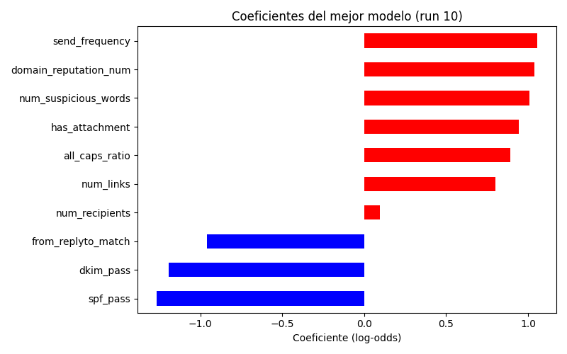

# Informe de variabilidad - Regresión logística
**Autoras:** María Camila Guzmán Bello y Ana María Casallas Ariza
**Materia:** Machine Learning 802
**Fecha:** 2025-09-09T13:37:43.636117

## Resumen ejecutivo
- Dataset usado: `C:/Users/Camila Guzman/OneDrive/Escritorio/Universidad/OCTAVO/ML/Actividad2/dataset_spam_ham_balanceado.csv`
- Corridas ejecutadas: 15
- Test size: 0.3
- GridSearchCV (cv=5, scoring=f1_macro)

## Resultados por corrida
|   run |   seed |   time_s |   cv_best_score |   test_accuracy |   test_f1_spam |   test_f1_macro |   intercept |   coef__num_links |   coef__num_suspicious_words |   coef__domain_reputation_num |   coef__all_caps_ratio |   coef__num_recipients |   coef__has_attachment |   coef__spf_pass |   coef__dkim_pass |   coef__from_replyto_match |   coef__send_frequency |
|------:|-------:|---------:|----------------:|----------------:|---------------:|----------------:|------------:|------------------:|-----------------------------:|------------------------------:|-----------------------:|-----------------------:|-----------------------:|-----------------:|------------------:|---------------------------:|-----------------------:|
|     1 |   1000 |     4.87 |        0.91417  |        0.916667 |       0.916201 |        0.916664 |  -0.131542  |          0.74269  |                     1.03568  |                      1.0507   |               0.946727 |              0.0444013 |               0.975885 |        -1.25684  |         -1.22184  |                  -1.0328   |                1.019   |
|     2 |   1001 |     0.15 |        0.914219 |        0.922222 |       0.922222 |        0.922222 |  -0.116289  |          0.78168  |                     0.942313 |                      1.02676  |               0.895434 |              0.0556466 |               0.956968 |        -1.21136  |         -1.15573  |                  -0.998624 |                1.08031 |
|     3 |   1002 |     0.19 |        0.910557 |        0.913889 |       0.915531 |        0.913856 |  -0.101858  |          0.789595 |                     0.896794 |                      1.01623  |               0.89253  |              0.106726  |               1.00887  |        -1.2752   |         -1.15951  |                  -1.05139  |                1.08677 |
|     4 |   1003 |     0.14 |        0.915419 |        0.9      |       0.902174 |        0.899951 |  -0.132176  |          0.815978 |                     1.00889  |                      0.963447 |               0.910593 |              0.136722  |               0.966911 |        -1.32537  |         -1.25031  |                  -0.984157 |                1.06938 |
|     5 |   1004 |     0.2  |        0.907072 |        0.905556 |       0.909091 |        0.905413 |  -0.289884  |          1.26394  |                     1.59705  |                      1.75567  |               1.46232  |             -0.0920155 |               1.60414  |        -2.05484  |         -2.02382  |                  -1.58274  |                1.70841 |
|     6 |   1005 |     0.16 |        0.911864 |        0.908333 |       0.910569 |        0.908276 |  -0.304616  |          1.56018  |                     2.08443  |                      2.17083  |               1.92463  |              0.110592  |               1.9223   |        -2.53457  |         -2.39027  |                  -1.94781  |                2.29951 |
|     7 |   1006 |     0.16 |        0.921362 |        0.894444 |       0.896175 |        0.894415 |  -0.290849  |          1.5234   |                     1.7787   |                      1.82416  |               1.62108  |              0.176922  |               1.7433   |        -2.27049  |         -2.04598  |                  -1.74663  |                1.94921 |
|     8 |   1007 |     0.17 |        0.914256 |        0.9      |       0.900552 |        0.899997 |  -0.450252  |          1.40531  |                     2.01965  |                      2.05692  |               1.68061  |              0.0873296 |               1.90459  |        -2.51678  |         -2.22386  |                  -1.93558  |                2.06989 |
|     9 |   1008 |     0.18 |        0.920164 |        0.894444 |       0.897849 |        0.894327 |  -0.0127432 |          0.341163 |                     0.395125 |                      0.435779 |               0.402058 |              0.0436633 |               0.400867 |        -0.500052 |         -0.465936 |                  -0.435123 |                0.40584 |
|    10 |   1009 |     0.17 |        0.898707 |        0.936111 |       0.936986 |        0.936099 |  -0.0799433 |          0.802162 |                     1.00922  |                      1.03712  |               0.891599 |              0.0955918 |               0.941635 |        -1.26651  |         -1.19535  |                  -0.959906 |                1.0565  |
|    11 |   1010 |     0.2  |        0.908287 |        0.913889 |       0.915989 |        0.913835 |  -0.0835967 |          0.812902 |                     0.980145 |                      1.1298   |               0.903589 |              0.0775929 |               0.984264 |        -1.30464  |         -1.17691  |                  -0.918199 |                1.12735 |
|    12 |   1011 |     0.2  |        0.907075 |        0.925    |       0.926027 |        0.924986 |  -0.275707  |          1.36106  |                     1.60758  |                      1.76865  |               1.52352  |              0.0301655 |               1.54486  |        -2.16807  |         -1.94397  |                  -1.64347  |                1.90355 |
|    13 |   1012 |     0.2  |        0.911882 |        0.919444 |       0.92011  |        0.919439 |  -0.351461  |          1.45918  |                     2.03132  |                      1.93536  |               1.68065  |             -0.0514508 |               1.99987  |        -2.51362  |         -2.3698   |                  -1.93143  |                2.20869 |
|    14 |   1013 |     0.14 |        0.91665  |        0.905556 |       0.906077 |        0.905553 |  -0.395885  |          1.55604  |                     2.1399   |                      2.19781  |               1.80836  |              0.135354  |               2.08746  |        -2.48085  |         -2.40471  |                  -2.09838  |                2.259   |
|    15 |   1014 |     0.15 |        0.916562 |        0.922222 |       0.924324 |        0.922162 |  -0.325197  |          1.55152  |                     1.9714   |                      2.16815  |               1.63625  |              0.0171455 |               1.82089  |        -2.5118   |         -2.42945  |                  -1.88081  |                2.2117  |

## Estadísticas globales
- F1 (spam) media: 0.9133
- F1 (spam) STD: 0.0116
- Accuracy media: 0.9119

## Mejor corrida (por F1 spam)
- Run: 10
- Seed: 1009
- Test F1 (spam): 0.9370
- Test Accuracy: 0.9361
- Best params: `{'classifier__C': 0.1, 'classifier__class_weight': None, 'classifier__penalty': 'l2'}`

### Ecuación logística (mejor modelo)
`logit(p) = -0.0799 + 0.8022*num_links + 1.0092*num_suspicious_words + 1.0371*domain_reputation_num + 0.8916*all_caps_ratio + 0.0956*num_recipients + 0.9416*has_attachment - 1.2665*spf_pass - 1.1954*dkim_pass - 0.9599*from_replyto_match + 1.0565*send_frequency `

### Gráfica de coeficientes

### Matriz de confusión del mejor modelo

